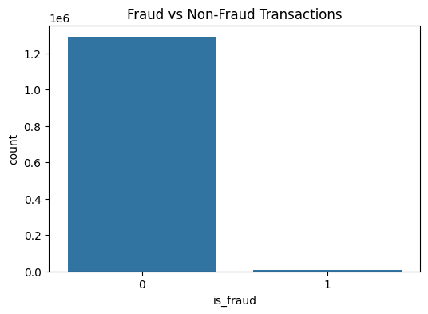
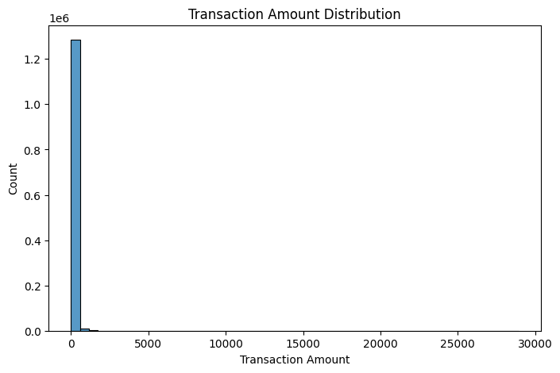
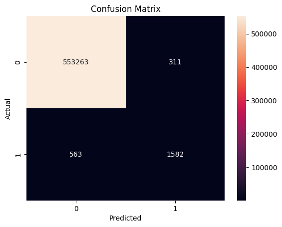
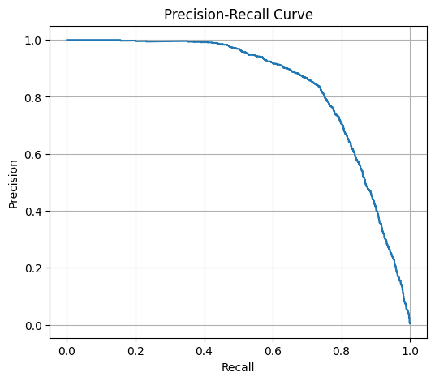
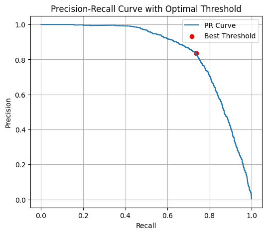

# Credit Card Fraud Detection using Machine Learning

## Project Overview
Credit card fraud is a major challenge for financial institutions because fraudulent transactions represent only a very small portion of total transactions.

The objective of this project is to build a machine learning model capable of identifying fraudulent transactions while minimizing false alarms.

The system uses **feature engineering, XGBoost, and threshold optimization** to improve fraud detection performance.

---

# Dataset

Dataset source:  
https://www.kaggle.com/datasets/kartik2112/fraud-detection

The dataset contains simulated credit card transactions generated using the **Sparkov fraud simulator**.

Files used:

```
fraudTrain.csv
fraudTest.csv
```

Target variable:

```
is_fraud
0 → Legitimate transaction
1 → Fraudulent transaction
```

---

# Data Imbalance

Fraud detection datasets are extremely imbalanced.

Example distribution:



Most transactions are legitimate, which means **accuracy alone is not a useful metric** for evaluating model performance.

---

# Transaction Amount Distribution

Transaction amounts are highly skewed.



Large spikes in transaction value may indicate suspicious activity.

---

# Feature Engineering

Several features were engineered to help the model learn behavioral patterns.

### Transaction Distance

Distance between customer location and merchant location.

```
distance = sqrt((lat - merch_lat)^2 + (long - merch_long)^2)
```

Fraud often occurs far from the customer's usual location.

---

### Transaction Hour

Transactions occurring at unusual times can be suspicious.

```
hour = (unix_time // 3600) % 24
```

---

### Log Transformation of Amount

```
amt_log = log(1 + amt)
```

Helps stabilize large transaction values.

---

### Amount Deviation

Measures how unusual a transaction amount is compared to the user's normal spending pattern.

---

# Model

The model used is **XGBoost**, a powerful gradient boosting algorithm widely used for tabular data.

Key parameters:

```
n_estimators = 500
learning_rate = 0.03
max_depth = 10
scale_pos_weight = 170
```

The `scale_pos_weight` parameter helps address class imbalance.

---

# Threshold Optimization

Instead of using the default classification threshold **(0.5)**, the threshold was optimized using the **Precision-Recall curve**.

This improves the balance between detecting fraud and minimizing false positives.

---

# Confusion Matrix



Interpretation:

- True positives → correctly detected fraud  
- False positives → legitimate transactions flagged as fraud  
- False negatives → missed fraud  

---

# Precision Recall Curve



This curve illustrates the trade-off between precision and recall.

---

# Precision Recall Curve with Optimal Threshold



The optimal threshold was selected to maximize the **F1-score**, balancing precision and recall.

---

# Model Performance

## Final Results

```
Precision : 0.84
Recall    : 0.74
F1 Score  : 0.78
```

Interpretation:

- **84% of predicted fraud alerts are correct**
- **74% of all fraudulent transactions are successfully detected**

---

# Repository Structure

```
credit-card-fraud-detection
│
├── notebook.ipynb
│
├── data
│   └── dataset_link.txt
│
├── outputs
│   ├── confusion_matrix.png
│   ├── precision_recall_curve.png
│   ├── pr_curve_optimal.png
│   ├── amount_distribution.png
│   ├── fraud_vs_nonfraud.png
│   └── model.pkl
│
└── README.md
```

---

# Technologies Used

- Python  
- Pandas  
- NumPy  
- Scikit-learn  
- XGBoost  
- Matplotlib  
- Seaborn  

---

# Future Improvements

Possible improvements include:

- Transaction velocity features  
- User behavior modeling  
- Real-time fraud detection API  
- Deep learning based anomaly detection  

---

# Author

Mohit Kaintura
