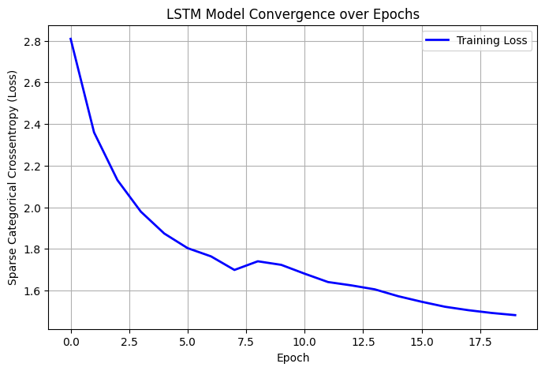

# LSTM Research Paper Text Generator

## Overview
This project implements a **Character-Level LSTM Language Model** trained on machine learning research papers to generate **scientific-style text**.

The system automatically collects **trending research papers**, downloads their PDFs from **arXiv**, extracts the text, and builds a dataset used to train the model. The trained LSTM can then generate **research-style paragraphs** similar to academic writing.

This project demonstrates **deep learning-based text generation using real research paper data**.

---

## Data Sources

The dataset used in this project was automatically created using publicly available research papers.

Data was collected from:

• Hugging Face Trending Papers  
https://huggingface.co/papers  

• arXiv Research Papers  
https://arxiv.org  

The Hugging Face trending page provides links to recent research papers, which are then downloaded as PDFs from arXiv.

---

## Dataset

Approximately **50 research papers** were downloaded and processed.

The text extracted from these PDFs is combined into a dataset file:

paper.txt

Dataset statistics:

- ~27,000+ words
- Extracted from ~50 research papers
- Cleaned research text used for training the model

---

## Project Pipeline

Trending ML Papers (HuggingFace)  
↓  
arXiv Paper Links  
↓  
Automatic PDF Download  
↓  
PDF Text Extraction  
↓  
Dataset Creation (paper.txt)  
↓  
Character-Level LSTM Training  
↓  
Research Style Text Generation  
↓  
Gradio Interactive Interface  

---

## Model Architecture

The project uses a **Character-Level LSTM neural network** implemented with TensorFlow/Keras.

Architecture:

Embedding Layer  
↓  
LSTM (256 units)  
↓  
Dropout  
↓  
LSTM (256 units)  
↓  
Dropout  
↓  
Dense Softmax Output Layer  

Training Parameters:

- Sequence Length: 100 characters  
- Step Size: 3  
- Batch Size: 256  
- Optimizer: Adam  
- Loss Function: Sparse Categorical Crossentropy  
- EarlyStopping used to prevent overfitting  

---

## Training Convergence

Below is the training loss curve showing **model convergence over epochs**.

The plot shows a steady decrease in **Sparse Categorical Crossentropy Loss**, indicating that the model is successfully learning patterns from the research paper dataset.

---

## Text Generation

Once the model is trained, it can generate text based on a **seed prompt**.

Example Prompt:

The machine learning model learns representations

Example Generated Output:

the machine learning model learns representations that capture long-term dependencies across sequential data while improving generalization performance in large-scale experiments.

Temperature parameter controls creativity:

0.2 → Conservative output  
0.5 → Balanced output  
0.8 → Creative output  
1.0 → Highly creative output  

---

## Interactive Interface

The project includes a **Gradio interface** that allows users to generate research-style text interactively.

Users can:

- Enter a prompt
- Adjust temperature
- Choose generation length
- Generate research-style text instantly

---

## Technologies Used

Python  
TensorFlow / Keras  
NumPy  
PyPDF  
Requests  
Matplotlib  
Gradio  

---

## Installation

Install required dependencies:

pip install tensorflow pypdf requests gradio matplotlib numpy

---

## Running the Project

1. Collect research papers and build dataset  
2. Extract text from PDFs into paper.txt  
3. Train the LSTM model  
4. Generate research-style text using the trained model  
5. Launch the Gradio interface

---

## Future Improvements

- Train on larger datasets (100k+ words)
- Use word-level language models
- Experiment with Transformer-based models
- Improve dataset cleaning pipeline
- Deploy as a web application

---

## Author Mohit kaintura 

Machine Learning Project  
LSTM-based Scientific Text Generator
